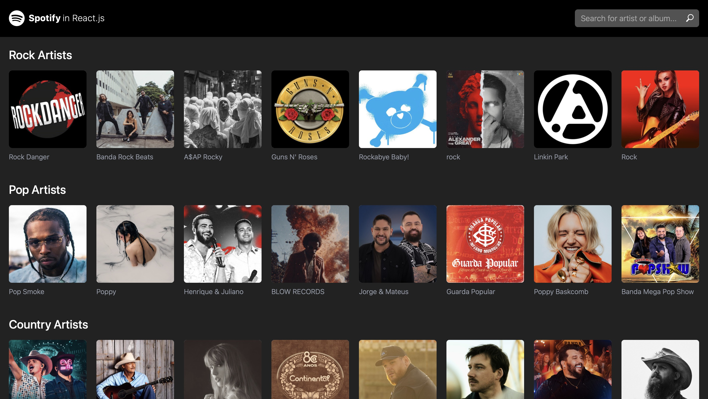

React application using [Spotify API](https://developer.spotify.com/documentation/web-api) that finds albums and artists.
[See the project](https://caueamaral.github.io/react-spotify).



## React

- Context API
- React Router DOM
- Tailwind CSS
- useEffect()
- useState()
- Axios
- Vitest

### How to use it

1 - Clone the repository.

```sh
git clone https://github.com/caueamaral/react-spotify.git
```

2 - Install the dependencies.

```sh
npm install
```

3 - Create a Account in [Spotify for Developers](https://developer.spotify.com).

4 - In the [Dashboard](https://developer.spotify.com/dashboard) create a new app.

5 - Get your `Client ID` and `Client secret` in [Dashboard](https://www.themoviedb.org/settings/api).

6 - Create a `.env` file in the root of the application with a `VITE_CLIENT_ID` and `VITE_CLIENT_SECRET` variables.

```
VITE_CLIENT_ID = 'insert-your-client-id-here'
VITE_CLIENT_SECRET = 'insert-your-client-secret-here'
```

7 - Start the web server.

```sh
npm run dev
```

8 - Open localhost in the browser.

```sh
http://localhost:5173/react-spotify
```
